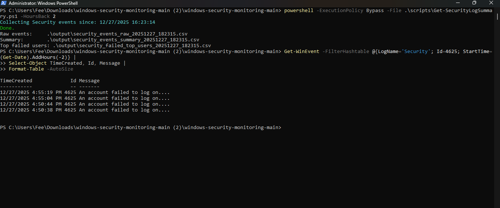

# windows-security-monitoring

## Overview
This project focuses on monitoring and analyzing Windows security events to detect suspicious activity, improve system visibility, and strengthen endpoint security.

## Objectives
- Understand Windows Event Logs
- Monitor authentication and privilege escalation events
- Identify suspicious behavior patterns
- Improve incident detection skills

## Tools & Technologies
- Windows Event Viewer
- PowerShell
- Windows Security Logs
- Sysinternals (future)

## Project Status
 In Progress — foundational setup and documentation

## Output Files

When executed, the script generates the following files in the `output/` directory:

- `security_events_raw_<timestamp>.csv` 
  Raw Windows Security Event Log entries collected from the system.

- `security_events_summary_<timestamp>.csv` 
  Aggregated summary of authentication-related events.

- `security_failed_top_users_<timestamp>.csv` 
  Users with the highest number of failed logon attempts.

These files are excluded from version control via `.gitignore`.

## Security Analysis

This script analyzes Windows Security Event Logs to identify authentication activity
and potential indicators of malicious behavior.

### Key Findings
- Repeated failed logon attempts may indicate brute-force or password spraying attacks
- Successful logons following multiple failures can indicate credential compromise
- High-volume authentication activity outside normal hours may indicate automated attacks

### Relevant Event IDs
- **4625** – Failed logon attempt
- **4624** – Successful logon
- **4672** – Special privileges assigned to new logon

This output helps defenders quickly identify suspicious authentication behavior
that warrants further investigation.

## Author
Devon Payton
